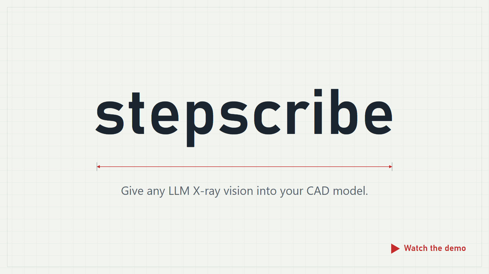
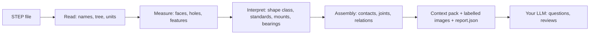

# stepscribe

Give any LLM X-ray vision into your CAD model. `stepscribe` reads a STEP file and writes an **LLM context pack**: exact measurements, holes, patterns, standard parts, assembly relationships and labelled images, all computed deterministically and offline (no AI model, no network).

[](https://github.com/idris900323/stepscribe/raw/main/docs/media/stepscribe-demo.mp4)

**[Watch the 1-minute demo with sound](https://github.com/idris900323/stepscribe/raw/main/docs/media/stepscribe-demo.mp4)** (opens in your browser's video player). No more screenshots and long explanations to get an AI to understand your model; the web page and the three Claude Code commands; made for beginner designers who want AI support.


## Start here

You need **Python 3.11 or newer**. Check with `python --version`; get it from python.org if it is missing.

**1. Install (one command, covers everything below):**

```bash
python -m pip install "stepscribe-cad[mcp]"
```

Then check it with `stepscribe --help`. If your shell says the command is not found, close and reopen the terminal (pip puts it in your Python `Scripts` folder).

**2. Pick how you want to use it:**

| I want to... | Do this |
|---|---|
| **Click, not type** (easiest) | Run `stepscribe ui`. A page opens in your browser at http://127.0.0.1:8765: drop a STEP file on it, watch the progress and time estimate, read the results in tabs, answer the designer questions, download a zip. Only your own computer can reach it. |
| Use it inside **Claude Code** | Install the plugin (see below), then type `/stepscribe:export my_robot.step`. |
| Get files for **any AI chat** (ChatGPT, Gemini, Claude.ai...) | Run `stepscribe export my_robot.step`, then paste the `_FULL.md`, `_COMPACT.md` or `_SMALL.md` file into the chat, or upload the `chat_bundle` folder. |
| Script it | `stepscribe pack`, `analyze`, `render`, `section` (see Quickstart). |

**Things worth knowing**

- Chat apps cannot take a STEP file as an attachment here. In Claude Code you give the **path**: start Claude Code in the folder that holds the file and type `/stepscribe:export my_robot.step`, or paste the full path.
- The result is **files on your disk**. The plugin saves them next to your STEP file in `my_robot_stepscribe/` plus a `.zip`, and tells you the full path. Open that folder in your file manager and attach the file you need to your chat. `stepscribe export` writes to `./out` unless you pass `-o`.
- Big assemblies take minutes. The page and the plugin show progress and an estimate; nothing is cut to go faster.
- Everything runs on your computer: no AI model, no network, no upload.

## Quickstart (command line)

```bash
stepscribe ui                                      # the browser page (see "Standalone web page" below)
stepscribe export robot.step -o out                # portable files for any AI: FULL, COMPACT, SMALL, chat bundle, zip
stepscribe pack robot.step -o out --material alu   # the multi-file context pack
stepscribe pack robots_folder/ -o out --jobs 4     # a whole folder, with index.md
stepscribe analyze robot.step -o out               # report.json only
stepscribe render robot.step --view exploded -o exploded.png
stepscribe section robot.step --plane "z=12.5"
stepscribe init-context                            # template for design intent / materials
```

From a source checkout instead: `python -m pip install -e ".[dev,mcp]"`.

## Use with AI tools

Every route ends with the same files, so you always walk away with something you own.

### 1. Any AI, nothing to install on its side

```bash
stepscribe export robot.step -o out
```

This writes `out/robot_stepscribe/` and `out/robot_stepscribe.zip`:

| File | Use it |
|---|---|
| `robot_FULL.md` | Big-context chats and documents: everything, every part in full detail |
| `robot_COMPACT.md` | Normal chats: the important parts in full, the rest short (about 40k tokens) |
| `robot_SMALL.md` and `chat_bundle/` | Free tiers and small or local models: about 12k tokens plus a few images, under 10 MB |
| `data/report.json` | Your own tools (schema included) |

Paste a Markdown file into the chat, or upload `chat_bundle/`. `MANIFEST.md` lists every file with sizes and token estimates. Exporting an unchanged file again reuses the finished export.

### 2. Claude Code plugin

First install the package (the plugin starts it; it does not install it): `python -m pip install "stepscribe-cad[mcp]"`. Then, in Claude Code:

```text
/plugin marketplace add idris900323/stepscribe
/plugin install stepscribe@stepscribe
```

Restart Claude Code if the commands do not show up; typing `/stepscribe` lists them. Start Claude Code in the folder that holds your STEP file, then:

| Command | What it does |
|---|---|
| `/stepscribe:export my_robot.step` | Analyses the file, shows progress, saves the export next to it (`my_robot_stepscribe/` and a zip) and says which file to use where. Start here. |
| `/stepscribe:interview my_robot.step` | Asks the designer questions one at a time (answer, "skip", "not sure", "back", "done") and rebuilds the export with your answers. |
| `/stepscribe:review my_robot.step` | A design review: summary, critical issues, important, minor, questions, what is done well, citing part IDs. |

The commands are independent. A good order is `export`, then `interview`, then `export` again, and `review` whenever you want the critique. You can also just ask in plain English ("what is weak in my_robot.step?"). To run the server without a prior install, change `plugins/stepscribe/.mcp.json` to `uvx --from "stepscribe-cad[mcp]" stepscribe mcp`.

### 3. Agent Skill

`skills/stepscribe/` follows the open Agent Skills format. Upload `dist/stepscribe-skill.zip` (from a release, or build it with `python scripts/sync_skills.py`) where custom skills are supported, or copy the folder into your skills directory. The skill needs an environment where stepscribe can be installed; it works best in Claude Code. Hosted code-execution sandboxes may not allow installing it, so use the export files there.

### 4. GitHub Copilot

The skill is in `.github/skills/stepscribe/`. For the MCP server, add this to `.vscode/mcp.json`:

```json
{
  "servers": {
    "stepscribe": { "type": "stdio", "command": "stepscribe", "args": ["mcp"] }
  }
}
```

### 5. Other MCP clients

```bash
python -m pip install "stepscribe-cad[mcp]"
stepscribe mcp
```

```json
{
  "mcpServers": {
    "stepscribe": { "command": "stepscribe", "args": ["mcp"] }
  }
}
```

Tools: `start_analysis`, `get_job_status`, `export_pack` (for big assemblies that outlast a client's call timeout), `get_overview`, `get_part`, `list_holes`, `list_cutouts`, `get_relations`, `measure_distance`, `section`, `render_view`, `find_parts`, `get_shopping_list`, `diff`, `get_questions`, `submit_answer`. Pass the absolute path of a STEP file. Images come back as PNG content of at most 1200 px; results are cached by file hash.

## What is in a pack

`00_READ_ME_FIRST.md`, `01_overview.md`, `02_assembly.md`, `03_parts/*.md`, `04_design_context.md` (if given), `05_understanding.md`, `context_pack.md` (single file under a token budget), `images/`, `data/report.json`.

Statements without a prefix are measured facts. Statements starting with **Likely:** are inferences with a confidence and evidence.

## How it works



Layers 1 and 2 (measure, interpret) are pure Python on the OpenCASCADE kernel: deterministic, offline, explainable. Layer 3 (judging the design) is done by your own LLM, outside this tool.

## Understanding layer (how the design works)

Beyond measuring, stepscribe forms rule-based hypotheses about a design (no model, no network). Each one has a confidence and evidence that points to part, joint and contact IDs; statements start with "Likely:". The results are in `05_understanding.md` and in the `understanding` section of `report.json`:

- **Structure and process:** ribs, gussets, steps, bends, lightening cutouts (and, for every part, recesses, windows and edge notches with sizes and positions), symmetry and mirror pairs, and the likely manufacturing process of each part (FDM, CNC, laser, sheet metal...).
- **Motion:** rigid links, the ground link, revolute and prismatic joints with their axes (servo horns included), degrees of freedom, a Mermaid diagram, and mechanisms (direct drive, gear pairs with ratio and module, GT2 belts, lead screws). `--check-motion` moves each joint and reports its free range and what blocks it.
- **Risks:** load paths, weak spots (edge distance, thin walls, single fasteners, cantilevers, short screws, tipping) with numbers and a suggestion, and a stability check (centre of mass against the support polygon).
- **Purpose:** a likely role for every part, and a short design summary.
- **Questions:** what geometry cannot tell (material, purpose, payload, what drives a joint), asked in order of value.

```bash
stepscribe pack robot.step --check-motion          # adds 05_understanding.md and joint arrows on the images
stepscribe kinematics robot.step                   # links, joints, mechanisms, Mermaid diagram
stepscribe weak-spots robot.step --material alu    # the risk table
stepscribe questions robot.step                    # lists questions, adds an answers: stub to design_context.yaml
stepscribe questions robot.step --json             # the same as JSON, for scripts
stepscribe answer robot.step --id QDC283C --value pla   # answer one question (also --skip, --not-sure, --undo)
stepscribe interview robot.step                    # answer them in the terminal; the pack is rebuilt
```

Answers apply in well under a second (the STEP file is not read again) and are saved in `design_context.yaml`, with a lock and an atomic replace so several writers can share it. The pack marks them "Confirmed by designer" or "Designer unsure", and an answer that contradicts the geometry is accepted with a visible conflict note. `scripts/eval_understanding.py` scores the layer against labels you write by hand (`tests/real_labels/example.yaml`).

## Standalone web page

```bash
stepscribe ui                  # local page: upload, progress with ETA, tabs, image viewer, interview, zip
stepscribe ui robot.step       # same, with a file preloaded
stepscribe ui --port 9000      # another port if 8765 is taken (--no-browser to not open a tab)
```

The page opens in your browser (at http://127.0.0.1:8765 by default). Drop a STEP file on it or type a path, press Analyse, and watch the progress bar with its time estimate. Tabs hold the context pack, understanding, parts, dimensions, assembly and images, plus the designer questions; images open in a viewer with arrows; the **Download pack (.zip)** button gives you the export. Stop it with Ctrl+C in the terminal.

This is separate from the AI integrations above: it runs only when you start it, is reachable from this computer only, and nothing in the MCP server, the skill or the plugin ever starts it. Large files can be read in place by typing their path.

## Optional: talk to a model directly

```bash
python -m pip install "stepscribe-cad[llm]"
export STEPSCRIBE_LLM_BASE_URL=http://localhost:11434   # Ollama, or any OpenAI-compatible /v1 URL
export STEPSCRIBE_LLM_MODEL=llama3.1:8b
stepscribe ask robot.step "What is the motor attached to?"
stepscribe eval robot.step      # factual questions scored against report.json
```

There is no default endpoint and no key is stored on disk (`STEPSCRIBE_LLM_API_KEY` is read from the environment). Set `STEPSCRIBE_LLM_VISION=1` to also send the images.

## Honest limitations

- STEP files rarely carry thread data, material or tolerances; the pack says so and only infers.
- Large assemblies take minutes (contact detection between complex solids is the slow part); a live ETA is shown. Assemblies of dozens of heavy parts can take much longer than that.
- Assemblies that only reference other STEP files cannot be read (a clear error says so).
- Knowledge tables (screws, motors, bearings, extrusions) are deliberately small and each entry cites its source; unsure values are left out.
- No hidden-line (HLR) drawings yet.
- Not yet checked against a CAD system for accuracy; verify important numbers there.

## Built with help from AI tools

Much of this code was written with AI assistance and then tested against generated ground-truth fixtures and real open-source robot files. Please verify important numbers against your CAD system.

## Project docs

- [CHANGELOG.md](CHANGELOG.md), [CONTRIBUTING.md](CONTRIBUTING.md), [docs/prelaunch_checklist.md](docs/prelaunch_checklist.md), [docs/plugin_testing.md](docs/plugin_testing.md)
- [examples/README.md](examples/README.md) (where to get open robot STEP files)

## License

stepscribe is free and open source under the [GNU AGPL-3.0](LICENSE). You may use, modify and share it under those terms, including the duty to publish source code when you distribute it or offer it as a network service. The analysis output you generate belongs to you. Companies that want to embed it in closed-source products or run a closed hosted service can get a commercial license: see [COMMERCIAL.md](COMMERCIAL.md). To contribute, read [CONTRIBUTING.md](CONTRIBUTING.md) and the [CLA](CLA.md). Third-party dependencies keep their own licenses.

"stepscribe" and its logo are trademarks of the maintainer; see [TRADEMARKS.md](TRADEMARKS.md).
